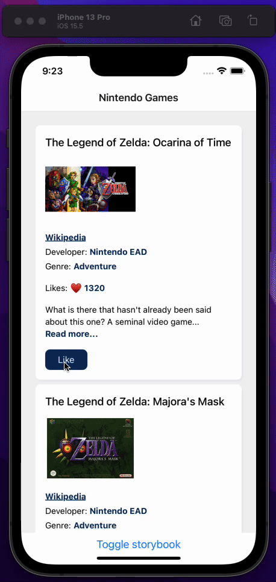

# N64 Voter App  🎮

## Introduction

This app's aim is allow users to vote for their favorite Nintendo 64 app.

This project is initialized using the https://github.com/tarikpnr/react-native-typescript-starter repo. 🚀

## Objective

We have a Nintendo 64. As a team, we need to decide which game to buy next.
Create a small single-page application that allows us to vote
on our favorite Nintendo 64 game.

## Requirements

- Please make an app to vote.
  - You can hardcode game data.
  - No need to persist data.
  - Show the box arts or game illustrations in a grid, all at once on the page (so no pagination).
  - It should allow voting on the 5-10 most popular N64 games.
  - The definition of 'popular' is up to you. Can be rating, sales or your personal opinion.
  - Clicking/tapping on a game casts a vote. The vote count should be visible somehow.
  


<h2>Demo</h2>

<div align="center">
  
</div>

---

<h2>Running e2e tests</h2>


<div align="center">
  
</div>

&nbsp;
<details><summary> Code </summary>

```js
// For more info on how to write Detox tests, see the official docs:
// https://github.com/wix/Detox/blob/master/docs/README.md

const { reloadApp } = require("./reload");

describe("Example", () => {
  beforeEach(async () => {
    await reloadApp();
  });

  it("First game card has the like text and button are available on the screen", async () => {
    // tests if the elements are on the screen
    await expect(element(by.id("game-card-like-text-1"))).toExist();
    await expect(element(by.id("game-card-like-button-1"))).toExist();

    // test game card has the like text available on the screen
    const likeTextAttrs = await element(
      by.id("game-card-like-text-1"),
    ).getAttributes();

    await expect(element(by.text(likeTextAttrs.text))).toExist();
  });

  it("pressing the like button of the first game card should increase the like count by one", async () => {
    // get like text(like count) before the like button is "tapped"
    const beforeLikeTextAttrs = await element(
      by.id("game-card-like-text-1"),
    ).getAttributes();

    // Tap to the like button to increase like count
    await element(by.id("game-card-like-button-1")).tap();

    // calculate final like text(count)
    const increasedLike = Number(beforeLikeTextAttrs.text) + 1;

    // get updated like text
    const afterLikeText = await element(
      by.id("game-card-like-text-1"),
    ).getAttributes();

    // test whether the like text(count) has been increased
    await expect(element(by.text(afterLikeText.text.toString()))).toHaveText(
      increasedLike.toString(),
    );
  });
});

```

</details>


<h2>Covered concepts</h2>

- Detox e2e testing
- React Native Storybook
- React Native Animations
- React Compound Components
- React Context
- Json server
- Optimistic updates with react query


## Running locally

Install dependencies

```bash
  yarn install
  ```

Run json-server

```bash
  yarn start-server
```

Start the emulator for ios.

```bash
 cd ios && pod install && yarn run ios
```

- For `pod install`, if you don't have cocoapods installed [here's a reliable way to install cocoapods](https://srz.io/posts/2022/01/installing-cocoapods/) in Nov 2022 that worked on MacOS Monterey/M2
- This assumes you have a simulator available for "iPhone 13". If you don't, simply include the name of one of the simulators installed e.g. `yarn run ios --simulator="iPhone 14"`


or for android

```bash
  yarn run android
```
